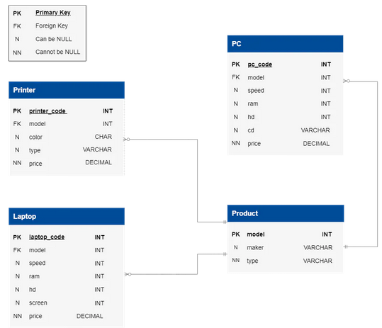
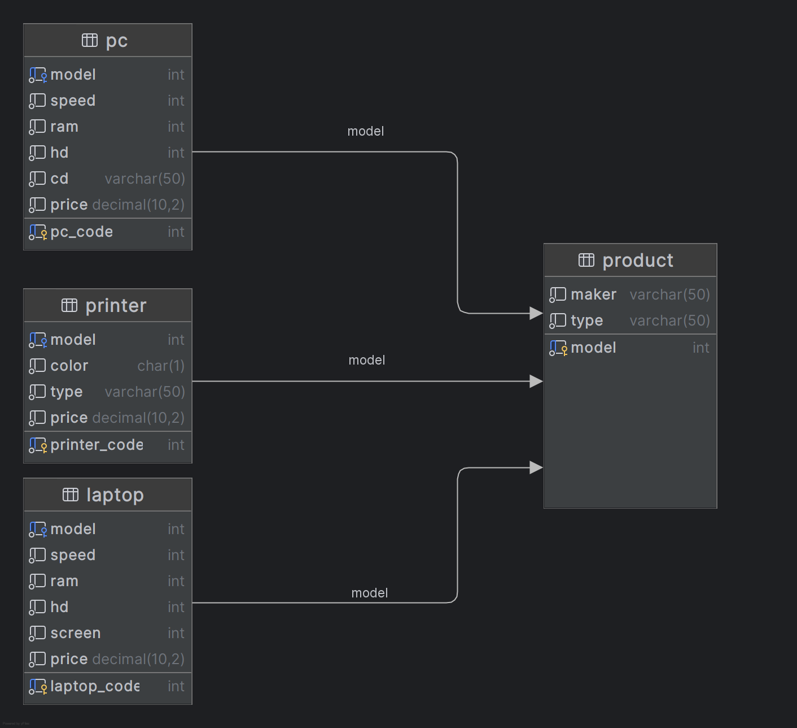

# Stage 5/6: High-end laptop vs. PC Prices
## Description
As a customer, you've heard that laptops tend to be more expensive than PCs. To verify this claim, you want to  
identify specific laptop models priced higher than the most costly PCs currently on the market. Also,  
to better understand the laptop price trends, compare average laptop and PC prices with those that cost more than  
the most expensive PC.

## Objectives
- Identify the laptops priced higher than any PC, including model, maker (Product table), and price.  
- Compute the differences: laptop vs. most expensive PC as price_difference_max_pc and laptop vs. average laptop price as price_difference_avg_laptop.  
- The order of the columns matters.

Take a look at the following database structure:



## Explanation of the database:
The Electronic Store Customer Database encompasses four main tables: Laptop, PC, Printer, and Product.

In-depth details of each table are as follows:

`Product`** table stores information about manufacturers (maker), model numbers (model), and product types (type).  
- `maker`: Manufacturer of a product in the store.
- `model`: Primary key - unique across all manufacturers and product types.
- `type` : Product identification, one of 3 types available: laptop, printer, PC

`PC`** table contains information about each personal computer.
- `pc_code`: Primary key - identified by a unique code.
- `model`: Foreign key - A PC model is indicated with a foreign key to the `Product` table (model).
- `speed` : Processor speed in megahertz.
- `ram` : Memory size in megabytes.
- `hd` : Hard disk capacity in gigabytes.
- `cd` : CD reader speed such as DVD, Blu-ray, or None.
- `price` : Price in dollars.

`Laptop`** table contains information about each laptop.
- `laptop_code`: Primary key - identified by a unique code.
- `model`: Foreign key - A PC model is indicated with a foreign key to the `Product` table (model).
- `speed` : Processor speed in megahertz.
- `ram` : Memory size in megabytes.
- `hd` : Hard disk capacity in gigabytes.
- `screen` : Screen size in inches.
- `price` : Price in dollars.

`Printer`** table provides information about each printer model.
- `printer_code`: Primary key - identified by a unique code.
- `model`: Foreign key - A PC model is indicated with a foreign key to the `Product` table (model).
- `color` : C for color printers, B for black printers.
- `type` : Printer types: Laser for laser printers, Inkjet for inkjet printers, Matrix for matrix printers.
- `price` : Price in dollars.

** Table names are case-sensitive



Click on the [link](Updated_Electronic_Store_Database.sql) to download the SQL query for creating the database.

## Example

_PC Table Example:_

| pc_code | model | speed | ram | price |
|---------|-------|-------|-----|-------|
| 1       | 101   | 2200  | 8   | 300   |
| 2       | 102   | 2000  | 16  | 450   |
| 3       | 101   | 2300  | 8   | 330   |
| 4       | 103   | 2000  | 8   | 280   |
| 5       | 104   | 2100  | 8   | 290   |

The highest `price` of a `PC` from the table above is `450`.

_Laptop Table Example:_

| laptop_code | model | maker  | price |
|-------------|-------|--------|-------|
| 1           | 101   | LG     | 400   |
| 2           | 102   | HP     | 460   |
| 3           | 101   | LG     | 350   |
| 4           | 103   | Apple  | 500   |
| 5           | 104   | Lenovo | 390   |

The table reveals that laptops with codes `2` and `4` are priced (`460` and `500`) higher than the highest-priced PC (`450`).  
The average laptop `price` is calculated as `(400 + 460 + 500 + 350 + 390) / 5 = 420`.   
Final output:

| model | maker | price | price_difference_max_pc | price_difference_avg_laptop |
|-------|-------|-------|-------------------------|-----------------------------|
| 102   | HP    | 460   | 10                      | 40                          |
| 102   | Apple | 500   | 50                      | 80                          |

## Query template:
```markdown
SELECT model, maker, price
       **write your code here** AS price_difference_max_pc
       **write your code here** AS price_difference_avg_laptop
...;
```